## 简介
captcha是一个图片/音频验证码生成工具库。

1.调用ImageCaptchaUtil中的方法来生成验证码图片信息,支持返回图片byte[],base64字符串和base64Data字符串。可设置干扰线类型来生成不同干扰类型的验证码图片。可已自定义图片背景颜色，图片宽度高度，字体，字体颜色，干扰类型，干扰数量等。通过继承AbstractDrawing类或实现IImageCaptcha进行自定义干扰内容。继承AbstractDrawing只需要实现其中的绘制干扰线方法。实现IImageCaptcha则需要手动实现所有的相关内容

2.支持音频验证码,音频验证码格式为wav格式。调用AudioCaptchaUtil中的方法来生成音频验证码,支持返回音频base64,base64Data和byte[]。可自定义添加音频验证码前缀音频和后缀音频,如:您的验证码是 2836 请输入(格式:prefix + code + suffix)。默认支持中文,英文,日语,俄语(仅支持0～9,a～z,A～Z)。可以通过继承AbstractAudioCaptcha类来实现其他语言。
## 使用
目前还没有推送maven仓库,下载地址:https://github.com/niuchangqing/captcha/releases/tag/v1.0.0-RELEASE

## 生成图片样例
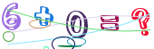 &emsp;&emsp;&emsp;  &emsp;&emsp;&emsp; 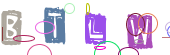

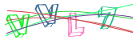 &emsp;&emsp;&emsp;  &emsp;&emsp;&emsp; 

 &emsp;&emsp;&emsp; 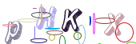 &emsp;&emsp;&emsp; 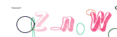

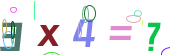 &emsp;&emsp;&emsp; &emsp;&emsp;&emsp;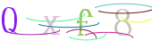

&emsp;&emsp;&emsp;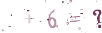&emsp;&emsp;&emsp;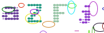

&emsp;&emsp;&emsp;&emsp;&emsp;&emsp;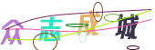

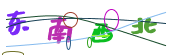&emsp;&emsp;&emsp;&emsp;&emsp;&emsp;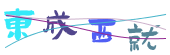
## 音频验证码样例
- 中文音频验证码样例下载地址

&emsp;&emsp;&emsp;[数字音频验证码](sample/audio/zh_example1.wav)&emsp;&emsp;&emsp;[字母音频验证码](sample/audio/zh_example2.wav)&emsp;&emsp;&emsp;[数字加字母音频验证码](sample/audio/zh_example3.wav)&emsp;&emsp;&emsp;[无前后缀音频验证码](sample/audio/zh_example4.wav)

- 英文音频验证码样例下载地址

&emsp;&emsp;&emsp;[数字音频验证码](sample/audio/en_example1.wav)&emsp;&emsp;&emsp;[字母音频验证码](sample/audio/en_example2.wav)&emsp;&emsp;&emsp;[数字加字母音频验证码](sample/audio/en_example3.wav)&emsp;&emsp;&emsp;[无前后缀音频验证码](sample/audio/en_example4.wav)

- 日语音频验证码样例下载地址

&emsp;&emsp;&emsp;[数字音频验证码](sample/audio/ja_example1.wav)&emsp;&emsp;&emsp;[字母音频验证码](sample/audio/ja_example2.wav)&emsp;&emsp;&emsp;[数字加字母音频验证码](sample/audio/ja_example3.wav)&emsp;&emsp;&emsp;[无前后缀音频验证码](sample/audio/ja_example4.wav)

- 俄语音频验证码样例下载地址

&emsp;&emsp;&emsp;[数字音频验证码](sample/audio/ru_example1.wav)&emsp;&emsp;&emsp;[字母音频验证码](sample/audio/ru_example2.wav)&emsp;&emsp;&emsp;[数字加字母音频验证码](sample/audio/ru_example3.wav)&emsp;&emsp;&emsp;[无前后缀音频验证码](sample/audio/ru_example4.wav)

## 使用例子
- 图片验证码
```java
//静态图片,支持返回图片的base64,base64Data,byte[]。(base64Data字符串浏览器可以直接解析)
String code = RandomUtil.randomString(5);
String imageBase64Data = ImageCaptchaUtil.getImageBase64Data(code);
//指定图片宽度,高度
String imageBase64Data1 = ImageCaptchaUtil.getImageBase64Data(code,100,35);
//指定图片宽度,高度，干扰线数量
String imageBase64Data2 = ImageCaptchaUtil.getImageBase64Data(code,100,35,10);
//指定图片宽度,高度,干扰线数量,干扰线类型
String imageBase64Data3 = ImageCaptchaUtil.getImageBase64Data(code,100,35,10,InterferenceTypeEnum.LINE);
//其他更多参数,如字体，字体颜色,背景颜色，干扰线颜色等等详细参数请看ImageCaptchaUtil类中的具体方法;
```
- GIF图片验证码
```java
//gif动态图片,支持返回图片的base64,base64Data,byte[]。(base64Data字符串浏览器可以直接解析)
String code = RandomUtil.randomString(5);
String gifImageBase64Data = ImageCaptchaUtil.getGifImageBase64Data(code);
//指定图片宽度,高度
String gifImageBase64Data1 = ImageCaptchaUtil.getGifImageBase64Data(code,100,35);
//指定图片宽度,高度,干扰线数量
String gifImageBase64Data1 = ImageCaptchaUtil.getGifImageBase64Data(code,100,35);
//指定图片宽度,高度,干扰线数量,干扰线类型
String gifImageBase64Data1 = ImageCaptchaUtil.getGifImageBase64Data(code,100,35,InterferenceTypeEnum.LINE);
//其他更多参数,如字体，字体颜色,背景颜色，干扰线颜色等等详细参数请看ImageCaptchaUtil类中的具体方法;
```

- 音频验证码
```java
//返回byte[],base64,baseData。(base64Data字符串浏览器可以直接解析)
//1.数字+字母音频验证码,默认中文
String code = RandomUtil.randomString(4);
String base64Data = AudioCaptchaUtil.getAudioBase64Data(code);
//2.指定语音类型
String code = RandomUtil.randomString(4,RandomUtil.NUMBER);
String base64Data = AudioCaptchaUtil.getAudioBase64Data(code,LanguageEnum.JA);
//3.指定音频验证码前缀音频和后缀音频内容。前缀/后缀音频文件格式为wav格式,InputStream
String code = RandomUtil.randomString(4);
String base64Data = AudioCaptchaUtil.getAudioBase64Data(code,LanguageEnum.JA,prefix,suffix);
```
- 结合Spring容器使用
```java
//1.图片(gif)验证码
//注入
@Bean
public IImageCaptcha iImageCaptcha() {
    //可以new其他实现类,如:new OvalCaptcha(135,40,10,CaptchaFont.getFont(CaptchaFont.CAPTCHA_FONT_1, Font.BOLD,40), null, null, null, null);
    return new BezierCurveCaptcha(135,40,5);
}
//使用
@Autowired
private IImageCaptcha iImageCaptcha;
String code = RandomUtil.randomString(4);
iImageCaptcha.getImageBase64Data(code);

//2.音频验证码
//注入
@Bean
public IAudioCaptcha iAudioCaptcha() {
    //new DefaultAudioCaptcha(LanguageEnum.ZH,prefix,suffix);
    return new DefaultAudioCaptcha(LanguageEnum.ZH);
}
//使用
@Autowired
private IAudioCaptcha iAudioCaptcha;
String code = RandomUtil.randomString(4);
iAudioCaptcha.getAudioBase64Data(code);
```
## 自定义字体使用
```java
//已内置16中字体,部分字体不支持中文
Font font = CaptchaFont.getFont(CaptchaFont.CAPTCHA_FONT_1, Font.BOLD, 40);
String imageBase64Data = ImageCaptchaUtil.getImageBase64Data(RandomUtil.randomString(4), 175, 55, 5, InterferenceTypeEnum.BEZIER, font);
```
## 常用随机字符串随机数子和随机运算字符串
RandomUtil类中实现了常用随机字符串数字等相关方法,方便用户生成code字符串

## 自定义字体表格(都支持数字以及字母)
|序号 |字体 |支持常用汉字 |样例 |
|----------|-----------|--------------|---------------------------|
|1|CaptchaFont.CAPTCHA_FONT_1|否||
|2|CaptchaFont.CAPTCHA_FONT_2|否||
|3|CaptchaFont.CAPTCHA_FONT_3|否|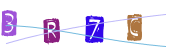|
|4|CaptchaFont.CAPTCHA_FONT_4|否||
|5|CaptchaFont.CAPTCHA_FONT_5|否|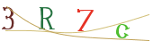|
|6|CaptchaFont.CAPTCHA_FONT_6|否|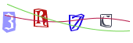|
|7|CaptchaFont.CAPTCHA_FONT_7|否|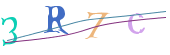|
|8|CaptchaFont.CAPTCHA_FONT_8|否|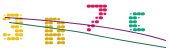|
|9|CaptchaFont.CAPTCHA_FONT_9|否||
|10|CaptchaFont.CAPTCHA_FONT_10|否||
|11|CaptchaFont.CAPTCHA_FONT_11|是|&emsp;|
|12|CaptchaFont.CAPTCHA_FONT_12|是|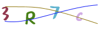&emsp;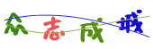|
|13|CaptchaFont.CAPTCHA_FONT_13|是|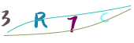&emsp;|
|14|CaptchaFont.CAPTCHA_FONT_14|是|&emsp;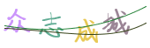|
|15|CaptchaFont.CAPTCHA_FONT_15|是|&emsp;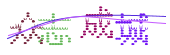|
|16|CaptchaFont.CAPTCHA_FONT_16|是|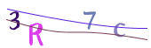&emsp;|
|17|CaptchaFont.CAPTCHA_FONT_17|否|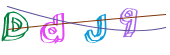|
|18|CaptchaFont.CAPTCHA_FONT_18|否|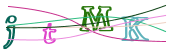|
|19|CaptchaFont.CAPTCHA_FONT_19|否||
|20|CaptchaFont.CAPTCHA_FONT_20|否||
|21|CaptchaFont.CAPTCHA_FONT_21|否|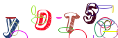|
备注:字体大小可调,获取自定义字体(Font font = CaptchaFont.getFont(CaptchaFont.CAPTCHA_FONT_1, Font.BOLD, 35);)

注意:自定义字体建议使用Spring容器注入或单例方式,防止字体文件过大影响性能